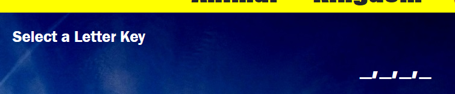
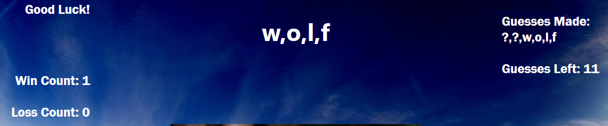
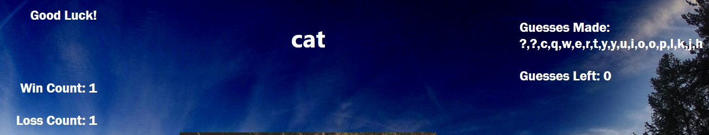

## Word-Guess-Game

### Word Guess Game is a hangman type game. The game starts when any key is pressed.

###  A set of underlines separated by commas is presented to the player, who then needs to guess what the correct letters are and the message to the user changes to 'Press Any Letter Key'.

### As the player makes guesses, correct ones fill in the underlined blanks. The number of guesses is decreased by one for each correct or incorrect guess.
### If the player guesses all the correct letters, the win counter will increase by 1 and a new game will start.

### If the player's number of guesses reaches zero, the loss counter will increase by 1 and the correct answer displayed.

### After a win or loss, a new game will start with the next keypress.

### The game was built using HTML, CSS, and JavaScript as the technologies with myself as the sole contributor.